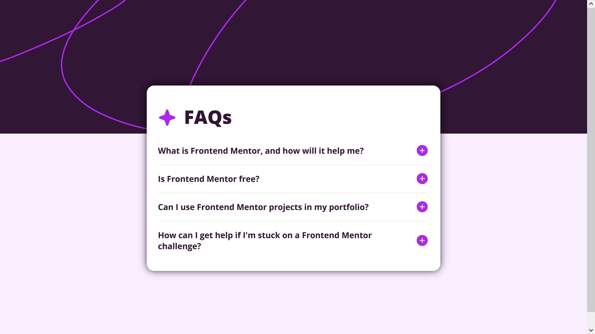

# Frontend Mentor - FAQ accordion solution

This is a solution to the [FAQ accordion challenge on Frontend Mentor](https://www.frontendmentor.io/challenges/faq-accordion-wyfFdeBwBz). Frontend Mentor challenges help you improve your coding skills by building realistic projects. 

## Table of contents

- [Overview](#overview)
  - [The challenge](#the-challenge)
  - [Screenshot](#screenshot)
  - [Links](#links)
- [My process](#my-process)
  - [Built with](#built-with)
  - [What I learned](#what-i-learned)
  - [Continued development](#continued-development)
  - [Useful resources](#useful-resources)
- [Author](#author)


## Overview
[Used tutorial](https://webdesign.tutsplus.com/how-to-build-an-accordion-using-only-html--cms-106881t)

### The challenge

Users should be able to:

- Hide/Show the answer to a question when the question is clicked
- Navigate the questions and hide/show answers using keyboard navigation alone (Skipped this one!)
- View the optimal layout for the interface depending on their device's screen size
- See hover and focus states for all interactive elements on the page

### Screenshot



### Links

- Solution URL: [FAQ Accordion solution](https://www.frontendmentor.io/solutions/responsive-faq-accordion-with-smooth-opening-content-panels-Fou1aI84J-)
- Live Site URL: [Live demo FAQ accordion](https://aphelion-faq-accordion.netlify.app)

## My process
Despite this project labeled as "Newbie" on [Frontendmentor.io](https://frontendmentor.io) I did wrestle with this project.

I am satisfied with the result.

### Built with

- Semantic HTML5 markup
- CSS 3
- Flexbox
- Mobile-first workflow
- JavaScript

### What I learned
__Useful things I learned__:
* That there are special HTML tags to build accordions with: `<summary>` and `<details>`. Alas, I could not animate these in CSS to open smoothly, so I chose another solution.
* That classList.toggle("oneClass") can hold one class. But written like below, you can toggle classes.
* That you can invert a boolean like this (When clicking a button, for example: `isBoolean = !isBoolean` (Also useful in React))

```javascript
  function toggleIcon(e) {
        e.target.classList.toggle("plus");
        e.target.classList.toggle("minus");
    }
```

### Continued development

* I might build a version of this project in React and/or Vue.js. 
* I am currently looking for a way to smoothen the opening of content panel with CSS only.
* I would have preferred to create the accordion with the `<details` and `<summary>` tags, but I am unable to open the content panel smoothly.
* Not satisfied that the plus and minus icons are now background images.
* I might put some animation on the plus and minus icons when hovering over them.


### Useful resources

- [HTML and CSS validator](https://validator.w3.org/nu/#textarea) - Always making sure there are no errors in my HTML and CSS files before finishing a project. This is my stamp of approval.
- [Flexy boxes: Flexbox playground and code generator](https://the-echoplex.net/flexyboxes/?fixed-height=on&display=flex&flex-direction=row&flex-wrap=nowrap&justify-content=center&align-items=center&align-content=stretch&order%5B%5D=0&flex-grow%5B%5D=0&flex-shrink%5B%5D=1&flex-basis%5B%5D=auto&align-self%5B%5D=auto&order%5B%5D=0&flex-grow%5B%5D=0&flex-shrink%5B%5D=1&flex-basis%5B%5D=auto&align-self%5B%5D=auto&order%5B%5D=0&flex-grow%5B%5D=0&flex-shrink%5B%5D=1&flex-basis%5B%5D=auto&align-self%5B%5D=auto) - Handy tool to help me create Flexbox layouts. I often use it for reference. Hoping to find a similar tool to help me create CSS Grid layouts.


## Author

- Website - [Live demo FAQ accordion ](https://aphelion-faq-accordion.netlify.app)
- Frontend Mentor - [@Aphelion-im](https://www.frontendmentor.io/profile/Aphelion-im)


